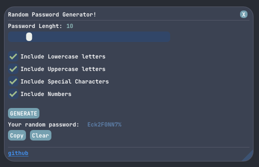

# PassGen

PassGen is a simple password generator made with c++



## Building the project

This project is built with CMake and includes dependencies such as GLFW (added as a submodule) and ImGui.

### 📁 Cloning the Repository 

```bash
git clone --recursive https://github.com/gabohs/PassGen.git
```

> Make sure to use the --recursive tag to clone submodules as well


### ⛏️ Building

####  📜 Using run.bat
Simply run the `run.bat` file
* the script will create a build/ directory, build the project and run the executable automatically.

#### 🛠️ Building manually

* Create build directory
```bash
cmake -B build
```

* Build
```bash
cmake --build build
```

* Run executable
```bash
./build/Debug/PassGen.exe
```

## Project Structure

### 🧠 Core Components

### `App` class
* Declared in src/App/App.h and defined in src/App/App.cpp
* Handles ImGui and GLFW boilerplate (initialization, glfw window context and shutdown)
* The `RenderUI` function, defined in src/App/renderUI.cpp contains the "front end" code.

### `PasswordGenerator` class
* Declared in src/App/PasswordGenerator/PasswordGenerator.h and defined in src/App/PasswordGenerator/PasswordGenerator.cpp
* Contains the logic for generating random passwords

### `Theme` folder
* Located at src/App/Theme
* Contains the `color.cpp` & `color.h`, that defines color schemes for the widgets and `style.cpp` & `style.h` that applies styling such as rounding, etc.


